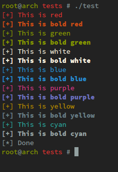
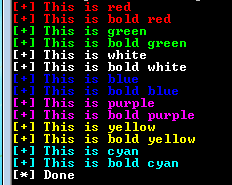

# color_shell
color_shell is a simple multi-platform C library that helps you to write some
colored text into a terminal. It's been tested on GNU/linux and Windows 7/10.

Here's how it renders on my linux box:



and on a Windows 7 machine:




Here's the list of provided functions:

```C
void w_red(char *fmt, ...);
void w_bred(char *fmt, ...);
void w_green(char *fmt, ...);
void w_bgreen(char *fmt, ...);
void w_white(char *fmt, ...);
void w_bwhite(char *fmt, ...);
void w_blue(char *fmt, ...);
void w_bblue(char *fmt, ...);
void w_purple(char *fmt, ...);
void w_bpurple(char *fmt, ...);
void w_yellow(char *fmt, ...);
void w_byellow(char *fmt, ...);
void w_cyan(char *fmt, ...);
void w_bcyan(char *fmt, ...);
void w_rewind(void);
```

Note: The `b` prefix stands for `bold`. Bold colors isn't supported on Windows.

# Usage
1. Clone this repo:
```
$ git clone git@github.com:Pr3ach/color_shell.git
```

2. Include color_shell header in your source file:
```c
/* $ vim main.c */
#include <stdio.h>
#include <stdlib.h>
#include "color_shell/src/color_shell.h"

#define NAME "bob"

int main(){
	w_green("I'm %s\n", name);

	return 0;
}
```

3. Compile & link against color_shell source file:
```
$ gcc main.c color_shell/src/color_shell.c -o main -s
```
